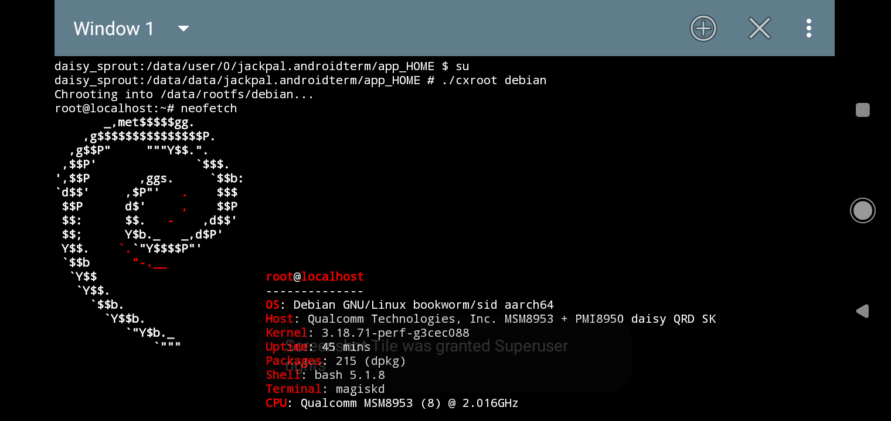

# cxroot
chroot into a Linux rootfs. For Android devices that have been rooted, be it using Magisk or other methods. Tested on an Android One device.
## Prerequisites
Get the Linux rootfs easily from:
```
https://uk.images.linuxcontainers.org/images/
```
If the link is not accessible, there are several mirrors available out there:
```
https://mirrors.tuna.tsinghua.edu.cn/lxc-images/images/
https://mirrors.cloud.tencent.com/lxc-images/images/
```
Make sure you choose the correct architecture and then extract it under `/data/rootfs/distro`.
## Usage
```
./cxroot /data/rootfs/distro
./cxroot distro
./cxroot /data/another/path/distro
```
## Screenshot

